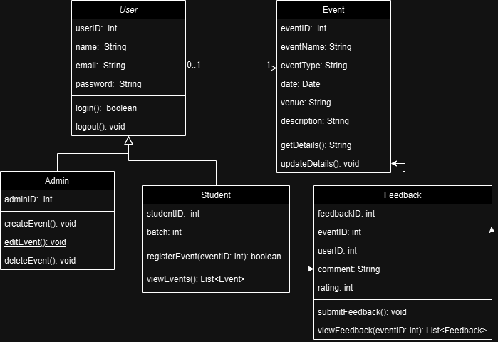

  

<h3 align="center">
  Course Title: Software Engineering
</h3>

<h3 align="center">
  Course Code: CSE 305
</h3>

<h3 align="center">
  Hajee Mohammad Danesh Science and Technology University,Dinajpur-5200.
</h3>
  

  

  

<h1 align="center">CSE Department Event Management System</h1>

The proposed system is a **CSE Department Event Management System (CDEMS)** that allows the administration, department, and students to efficiently organize, manage, and participate in department-related events such as workshops, seminars, sports, or cultural fests. The system will automate various processes, including event registration, notifications, schedules, feedback collection, and result announcements. This project idea can be developed step by step by applying the **Software Development Life Cycle (SDLC)** to ensure a high-quality system.

<h1 align="center">SDLC phases apply to my CSE Department Event Management System</h1>

## Planning
  
**Objective**: Define the scope and purpose of the idea.

**Activities**:
- Identify the need for the project (e.g., ease of managing departmental events)
- Determine the target users (students, department, organizers).
- Outline key goals, such as organizing workshops, seminars, fests, and sports effectively.

## Requirements Analysis

**Objective**: Identify the expected features and constraints of the system.

**Activities**:
- List functional requirements (e.g., event scheduling, participant registration).
- Document non-functional requirements (e.g., user-friendly interface, file-based storage).
- Analyze potential challenges (e.g., limited resources, user adoption).

## Design

**Objective**: Visualize the structure and functionality of the system.

**Activities**:
- Sketch high-level mockups for the user interface (event calendar, registration forms).
- Plan how data will be structured and stored in files.
- Create diagrams to map workflows like event creation and participant registration.

## Conceptualization (In place of Implementation)

**Objective**: Develop the theoretical framework of the system.

**Activities**:
- Describe how the system would function in various scenarios.
- Specify the roles of users (admins vs. participants).
- Draft guidelines for how events would be managed and displayed.

## Review and Validation

**Objective**: Validate the project idea with stakeholders.

**Activities**:
- Present the idea to peers, faculty, or department heads.
- Gather feedback on the feasibility and usefulness of the proposed system.
- Revise the idea based on suggestions and feedback.

## Documentation

**Objective**: Create comprehensive documentation of the project idea.

**Activities**:
- Write a project report detailing the purpose, features, and expected benefits.
- Include diagrams, mockups, and descriptions of workflows.
- Document potential future extensions or implementation plans.

## Class Diagram
The Class Diagram for the **CSE Department Event Management System** is designed to represent the various entities involved in managing department events efficiently. It illustrates the different classes and their relationships, providing an abstraction of the system's core components.
 

  

 

## Test Cases Sample

|Test ID |         Test Condition                    |     Test Steps                                |      Test Input                          |    Test outcome        |    Actual Outcome    |   Status    |
|--------|-------------------------------------------|-----------------------------------------------|------------------------------------------|------------------------|----------------------|-------------|
|  1     |With valid user ID & password if login able|1.Enter username 2.Enter password 3.Login|Username:shafiqul Password:hstushafiqul|    Login successful    |   Login successful   |    Pass     |
|        |                                           |                                               |                                          |                        |                      |             |
|        |                                           |                                               |                                          |                        |                      |             |
|        |                                           |                                               |                                          |                        |                      |             |
|  2     | With invalid user Id & password           |1.Enter username 2.Enter password 3.Login|Username:sazu Password:hstusazu        |  Login unsuccessful    |  Login unsuccessful  |    Pass     |
|        |                                           |                                               |                                          |                        |                      |             |
|        |                                           |                                               |                                          |                        |                      |             |

 

## Gantt Chart Representation

[Gantt chart](https://www.gantt.com/) for my **CSE Department Event Management System** based on my **Software Development Life Cycle (SDLC)**:

|          Activity                  |   Duration      |        Dependencies              |
|------------------------------------|-----------------|----------------------------------|
| Requirement Analysis               |    1 week       |   None                           |
| System Design                      |    2 weeks      |   Requirement Analysis           |
| Conceptualization                  |    4 weeks      |   System Design                  |
| Testing                            |    2 weeks      |   Conceptualization              |
| Deployment                         |    1 week       |   Testing                        |
| Maintainance                       |    Ongoing      |   Deployment                     |
 

|Activity              |Week 1|Week 2 Week 3|Week 4 Week 5 Week 6 Week 7|Week 8 Week 9|Week 10|Week N              |
|----------------------|------|-------------|---------------------------|-------------|-------|--------------------|
|Requirement Analysis  |██████|             |                           |             |       |                    |
|System Design         |      |██████████   |                           |             |       |                    |
|Conceptualization     |      |             |██████████████             |             |       |                    |
|Testing               |      |             |                           |██████████   |       |                    |
|Deployment            |      |             |                           |             |██████ |                    |
|Maintenance           |      |             |                           |             |       |████████████████████|(Ongoing)
 

## Conclusion

The **CSE Department Event Management System** is designed to streamline the process of organizing and managing departmental events efficiently. With its robust features for handling events, schedules, participants, and resources, the system ensures that every aspect of event planning and execution is seamlessly integrated.

This project aims to minimize manual effort, enhance collaboration, and provide a centralized platform for managing events of varying scales. By following the outlined development phases and utilizing the provided resources, the system can be further extended and customized to meet specific departmental needs.

We hope this project serves as a valuable tool for the department and contributes to the success of academic and extracurricular events. For further enhancements or issues, feel free to refer to the documentation or raise queries in the project repository.
   

 <h1 align="center">Submitted By</h1>

 
Md. Shafiqul Islam Sazu Student ID: 2102035 Level: 3 Semester: I Department of Computer Science and Engineering

  

<h1 align="center">Submitted To</h1>

 
Pankaj Bhowmik Lecturer Department of Computer Science and Engineering

