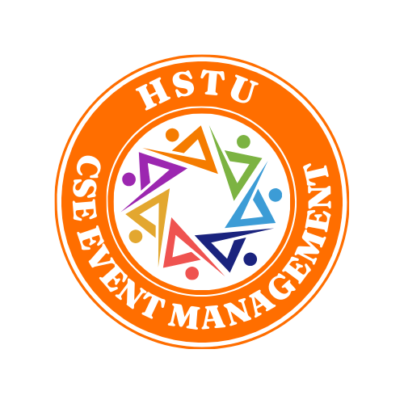

  

<h3 align="center">
  Course Title: Software Engineering
</h3>

<h3 align="center">
  Course Code: CSE 305
</h3>

<h3 align="center">
  Hajee Mohammad Danesh Science and Technology University,Dinajpur-5200.
</h3>
  

  

   

<h1 align="center">CSE Department Event Management System</h1>

 
The proposed system is a *CSE Department Event Management System (CDEMS)* that allows the administration, department, and students to efficiently organize, manage, and participate in department-related events such as workshops, seminars, sports, or cultural fests. The system will automate various processes, including event registration, notifications, schedules, feedback collection, and result announcements. This project idea can be developed step by step by applying the *Software Development Life Cycle (SDLC)* to ensure a high-quality system.
   

 
<h1>Planning</h1>
Objective: Define the scope and purpose of the idea.
Activities:
Identify the need for the project (e.g., ease of managing departmental events).
Determine the target users (students, department, organizers).
Outline key goals, such as organizing workshops, seminars, fests, and sports effectively.
 
